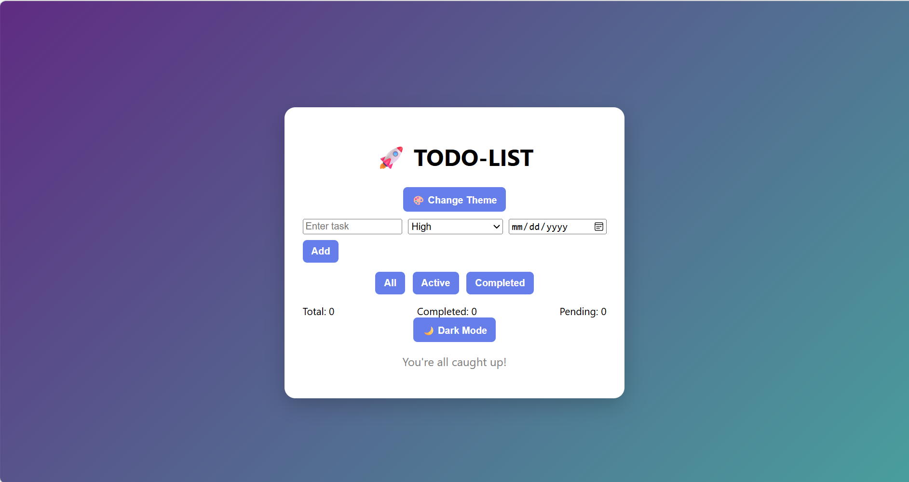
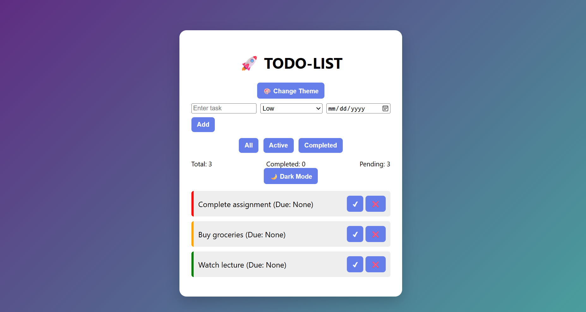
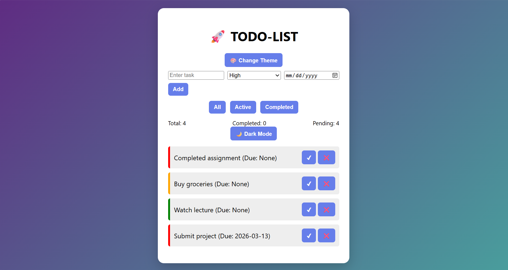
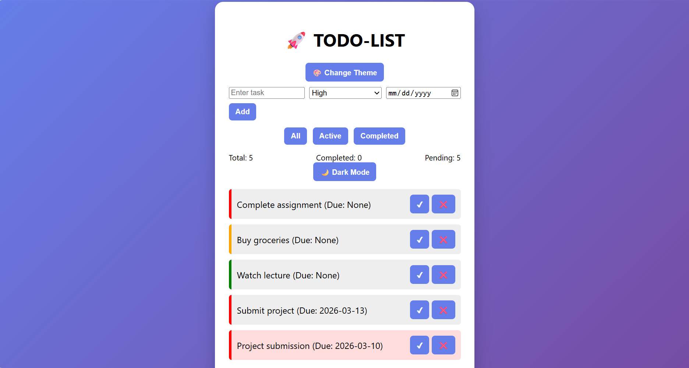
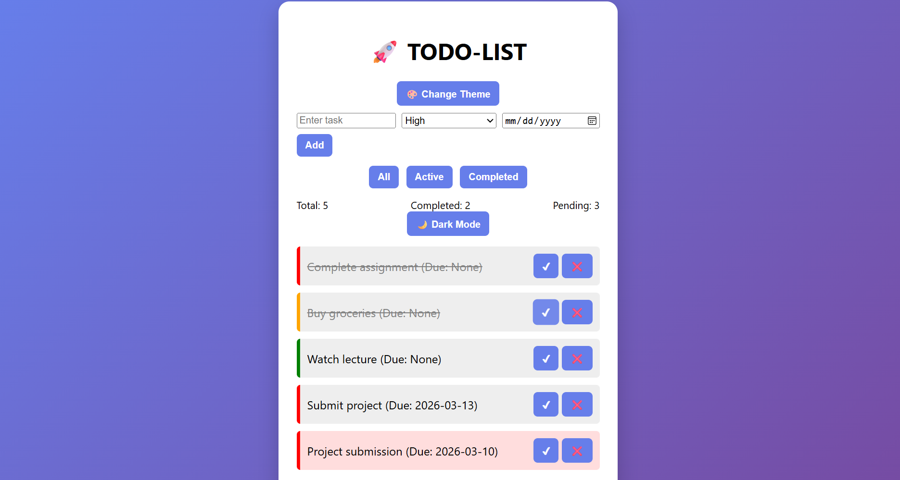
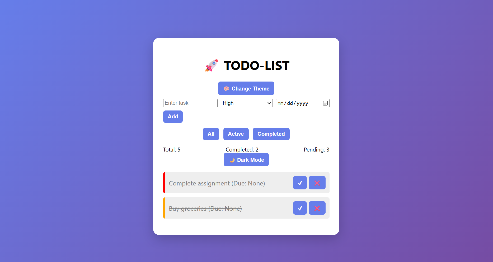
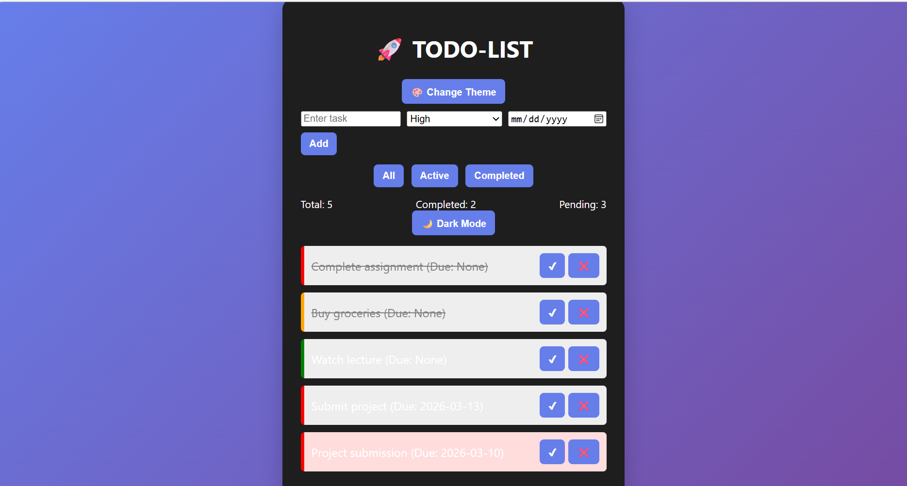
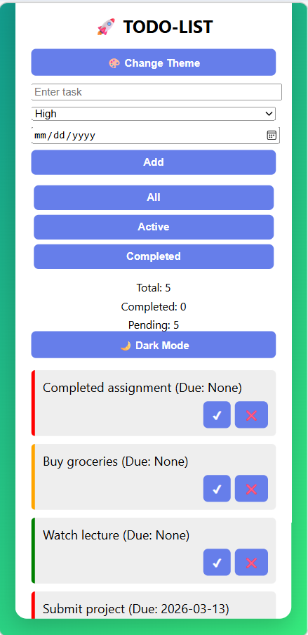

# 🚀 Client-Side Todo List Application

## 📌 Project Overview
This project is a simple and responsive Todo List web application that allows users to manage their daily tasks efficiently.  
The application is completely client-side and uses browser **localStorage** to store tasks so they remain saved even after refreshing the page.

---

## 🎯 Project Objective
The objective of this project is to build a task management application that allows users to:

- Add new tasks
- Set priority levels
- Assign due dates
- Mark tasks as completed
- Delete tasks
- Filter tasks
- View task statistics

---

## 🛠 Technologies Used
- **HTML5** – Structure of the application
- **CSS3** – Styling and responsive design
- **JavaScript (ES6)** – Application logic
- **LocalStorage API** – Data persistence

---

## ✨ Features
- Add tasks with priority levels (High / Medium / Low)
- Set due dates for tasks
- Highlight overdue tasks
- Mark tasks as completed
- Delete tasks
- Task filtering (All / Active / Completed)
- Task statistics (Total / Completed / Pending)
- Theme switcher and dark mode
- Responsive design for desktop and mobile devices

---

## 📷 Project Screenshots

### 🏠 Home Interface

### 🔥 Priority Tasks

### 📅 Due Date Feature

### ⚠ Overdue Task Warning

### ✅ Completed Task (Strike-through)

### 📂 Completed Task Filter

### 🎨 Theme / Dark Mode

### 📱 Mobile Responsive View

---

## ⚙ Setup Instructions
To run this project locally:

1. Download the project folder.
2. Open the folder.
3. Double-click **index.html** or open it in any web browser.

No installation or backend server is required.

---

## 📱 Responsive Design
The application is fully responsive and works properly on:

- Desktop
- Laptop
- Mobile devices
- Tablets

---

## ⚠ Challenges Faced
- Implementing **localStorage** for persistent data storage.
- Managing task filtering and updates dynamically using JavaScript.
- Ensuring the layout works properly on both desktop and mobile screens.

---

## 👩‍💻 Author
Sonam 

Minor Project Submission